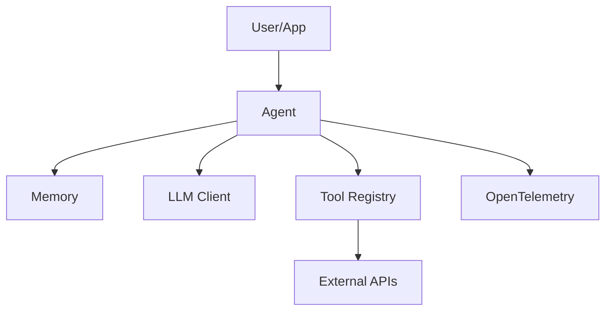

# 🤖 AI Agentic Framework

A production-ready, composable AI Agentic Framework designed for building complex, multi-agent systems with ease. It features dynamic agent creation, robust orchestration, multi-layer memory, and enterprise-grade observability.

[**📚 Documentation**](https://selvamanigovindaraj.github.io/ai-agentic-framework/)

## 🌟 Key Features

- **Composable Architecture**: Modular design for Agents, Tools, Memory, and LLM Clients.
- **ReAct Reasoning Engine**: Robust thought-action-observation loop for complex problem solving.
- **Multi-Agent Orchestration**: Support for collaborative workflows and agent handoffs.
- **Memory Systems**: Pluggable memory providers (Simple, Vector-based) for context retention.
- **Tool Registry**: Centralized management of tools with automatic parameter extraction.
- **Observability**: Built-in OpenTelemetry integration for tracing agent execution.
- **Safety & Control**: Cost limits, iteration caps, and sandbox environments.

## 🏗️ Architecture

The framework is built around the **Agent** core, which orchestrates the interaction between:
1.  **LLM Client**: The brain (e.g., OpenAI GPT-4).
2.  **Memory**: The context (Short-term session history + Long-term storage).
3.  **Tools**: The capabilities (Calculator, API calls, Custom functions).



## 📦 Components

### 1. Agent
The `Agent` class is the main entry point. It implements the ReAct loop, managing the state, history, and tool execution.

```python
from agentic_framework import Agent
from agentic_framework.llm import OpenAIClient

agent = Agent(
    id="researcher",
    name="Researcher",
    instructions="You are a helpful research assistant.",
    model_client=OpenAIClient(),
    tools=[]
)
```

### 2. Tools
Tools are executable functions that agents can use. Define custom tools by inheriting from `Tool`.

```python
from agentic_framework.core.tool import Tool

class MyTool(Tool):
    def __init__(self):
        super().__init__(name="my_tool", description="Does something useful")
    
    async def execute(self, param: str) -> str:
        return f"Executed with {param}"
```

### 3. Memory
Memory providers allow agents to retain information. `SimpleMemory` is provided for testing, but you can implement `MemoryProvider` for vector databases (Chroma, Pinecone, etc.).

```python
from agentic_framework.memory.simple import SimpleMemory

agent = Agent(..., memory=SimpleMemory())
```

### 4. Observability
Enable OpenTelemetry tracing by setting `ENABLE_TELEMETRY=true`. The framework automatically traces agent execution, tool calls, and LLM requests.

## 🚀 Quick Start

### Prerequisites
- Python 3.10+
- `uv` (recommended) or `pip`
- OpenAI API Key

### Installation

1.  **Clone the repository:**
    ```bash
    git clone https://github.com/selvamanigovindaraj/ai-agentic-framework.git
    cd ai-agentic-framework
    ```

2.  **Install dependencies:**
    ```bash
    uv sync
    # OR
    pip install -e .
    ```

3.  **Configure Environment:**
    ```bash
    cp .env.example .env
    # Edit .env and add your OPENAI_API_KEY
    ```

### Usage Examples

#### Basic Agent
Run the CLI to test a basic agent:
```bash
uv run agentic test
```

Or use Python:
```python
import asyncio
from agentic_framework import Agent, ToolRegistry
from agentic_framework.llm import OpenAIClient
from agentic_framework.tools.calculator import Calculator

async def main():
    llm = OpenAIClient()
    registry = ToolRegistry()
    registry.register(Calculator())
    
    agent = Agent(
        id="math_agent",
        name="Math Agent",
        instructions="You are a math wizard.",
        tools=registry.get_all(),
        model_client=llm
    )
    
    result = await agent.execute("What is 50 * 25?")
    print(result["output"])

if __name__ == "__main__":
    asyncio.run(main())
```

#### Multi-Agent Workflow
Run the multi-agent example:
```bash
uv run agentic multiagent
```

## 🛠️ Configuration

The `Agent` can be configured via `AgentConfig`:

| Parameter | Default | Description |
| :--- | :--- | :--- |
| `max_iterations` | 10 | Max ReAct loops per task |
| `timeout_seconds` | 300 | Execution timeout |
| `max_cost` | 1.0 | Max estimated cost ($) |
| `temperature` | 0.7 | LLM creativity |

## 🧪 Testing

Run the end-to-end test suite:
```bash
uv run pytest tests/test_e2e.py
```

## 🤝 Contributing

Contributions are welcome! Please submit a Pull Request.

## 📄 License

MIT License
